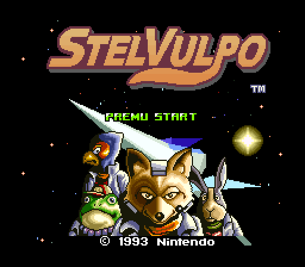
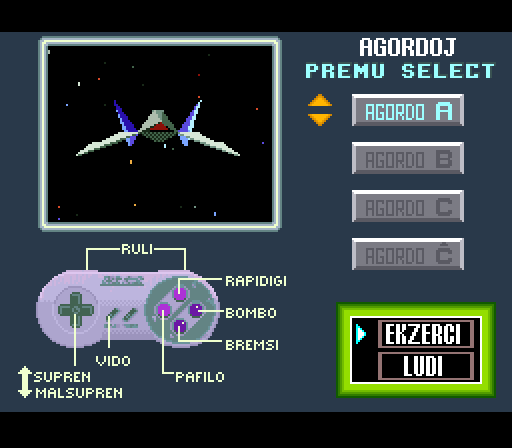
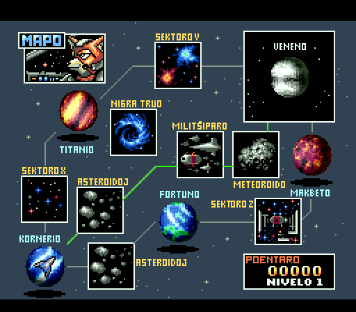
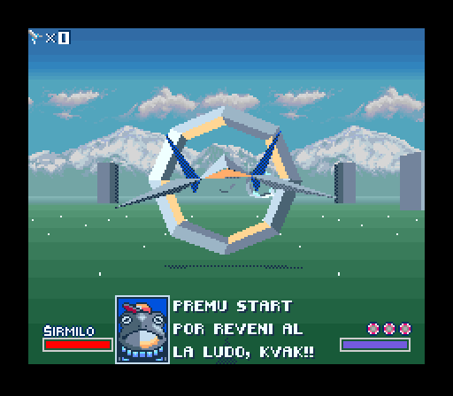
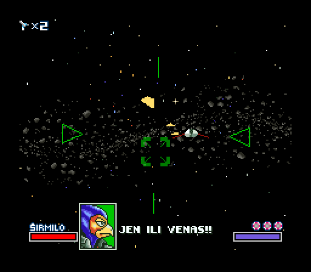
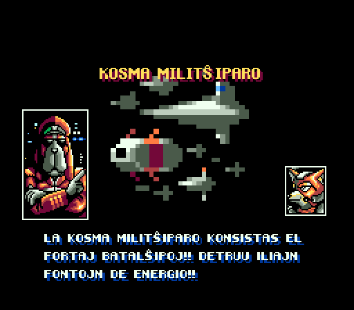
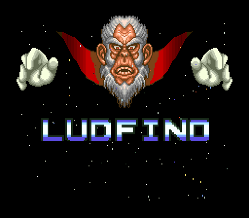
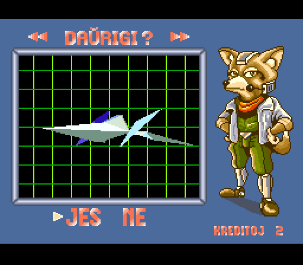

# STELVULPO

Star Fox in Esperanto

*Legu [starfox-readme.txt](starfox-readme.txt) por esperanta priskribo*

This project is a fan translation of
[Star Fox](http://en.wikipedia.org/wiki/Star_Fox_%28video_game%29), a video
game for the Super NES platform, to Esperanto. All copyrights to the original
game belong to Nintendo and no infringement is intended.

Development is based of StarFoxForNewModders.

## Requirements

You *must* own a physical copy of the Star Fox cartridge. Downloading the ROM
of any game which you do not own is piracy.

  * Star Fox (USA) (Rev 1) - CRC32 `06446e7c`

## Development

Other code/repositories of interest:

  * [cgx2fx/fx2cgx](https://github.com/Sunlitspace542/ultrastarfox/tree/main/TOOLS/cgx2fx_fx2cgx_src)
  * [FastFX](https://github.com/Sunlitspace542/FastFX)
  * [sf_crunch/sf_decrunch](https://www.romhacking.net/utilities/1543/)
  * [starfox_spc_driver](https://github.com/phonymike/starfox_spc_driver)
  * [star-fox-sound-bins](https://github.com/Sunlitspace542/star-fox-sound-bins)

## Screenshots

Here are some pretty screenshots:

