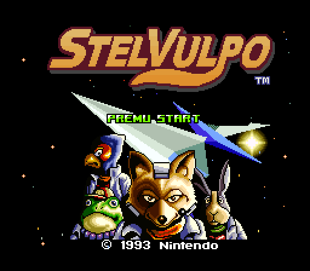
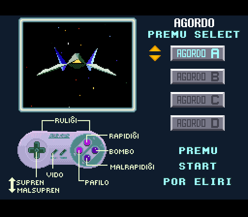
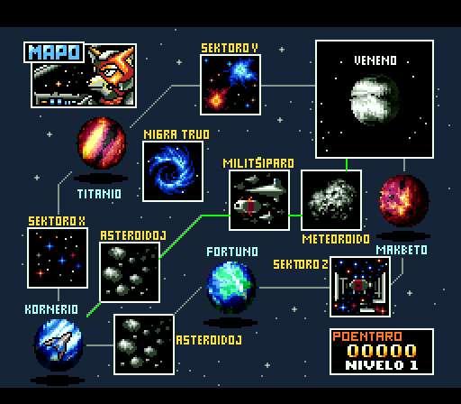
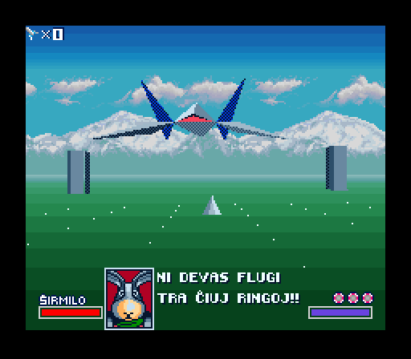
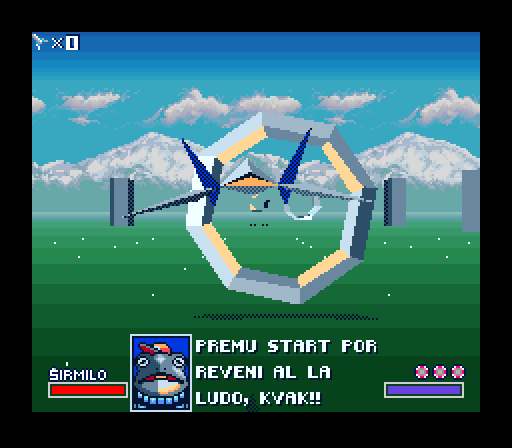
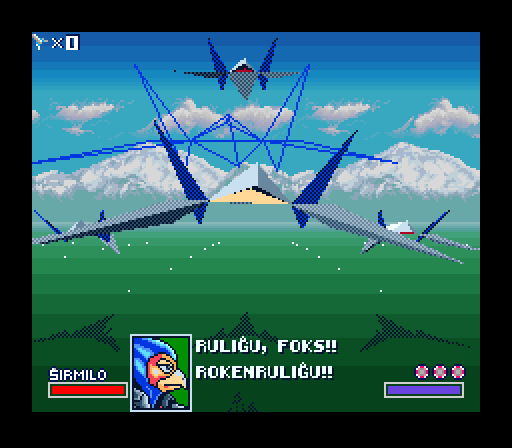
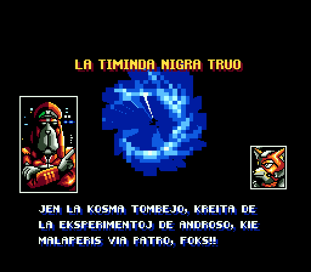
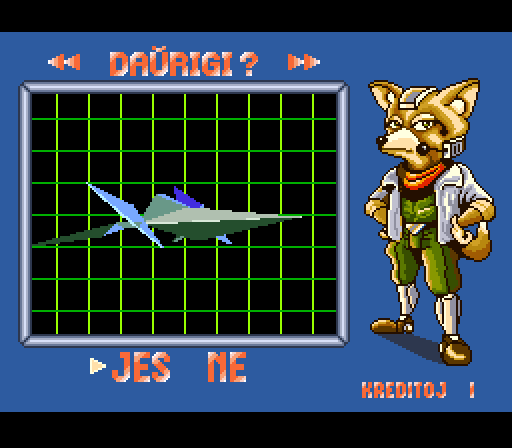

# STELVULPO

Star Fox in Esperanto

This project is a fan translation of
[Star Fox](http://en.wikipedia.org/wiki/Star_Fox_%28video_game%29), a video
game for the Super NES platform, to Esperanto. All copyrights to the original
game belong to Nintendo and no infringement is intended.

## Requirements
You *must* own a physical copy of the Star Fox cartridge. Downloading the ROM
of any game which you do not own is piracy.

  * Star Fox - CRC32 `8FC4E6D0`

## Development

The following software is used for development:

  * your prefered hex editor
  * [bsnes-plus](https://github.com/devinacker/bsnes-plus) - debugger
  * [Monkey Moore](https://www.romhacking.net/utilities/513) - relative search utility
  * [Cartographer](https://www.romhacking.net/utilities/647) - script extraction utility
  * [Atlas](https://www.romhacking.net/utilities/224) - script insertion utility
  * [YY-Chr](https://www.romhacking.net/utilities/958) - graphic editor
  * [SnesGFX](https://www.smwcentral.net/?p=section&a=details&id=6523) - graphic format converter
  * [snesbrr](https://www.smwcentral.net/?p=section&a=details&id=8976) - sound utility
  * [Lunar Address](https://www.romhacking.net/utilities/26) - address converter
  * [Lunar Compress](https://www.romhacking.net/utilities/330) - graphic compression utilities
  * [Checksum Recalculator](https://www.romhacking.net/utilities/499) - checksum utility
  * [Lunar IPS](https://www.romhacking.net/utilities/240) - patching utility
  * [Star Fox 2 Font Tools](https://www.romhacking.net/utilities/346) - encode/decoding utilities
  * [Audacity](https://www.audacityteam.org/) - to edit sound files

Most of the above utilities run on Windows while the build script `build.sh`
scripts the final patching and invokes unix/Linux utilities. You can either use
[Cygwin](http://cygwin.com) to run the build script on Windows or
[Wine](https://winehq.org) to run the utilities on non-Windows platforms.

### Docker

For those fond of [Docker](https://docker.com), the included `Dockerfile`
creates a basic development environment based on Ubuntu 20.04.

  * Build Docker image 

      `docker build -t sfox - < Dockerfile`

  * Run docker container (assumes X11/XQuartz/Xming)

      `docker run -it -v "$PWD:/sfox" -w /sfox -e DISPLAY=host.docker.internal:0 sfox bash`

  * Run `wineboot` the first time the container is run

## Completed

The following tasks are (more or less) complete.

  * Modify font files for esperanto letters
  * Translate and replace dialog, enemy, and credits text
  * Start, settings, level select, and continue screens
  * Replace sound files

## To Do  

The following tasks are still outstanding (in approximate order of importance).
**Contributors are welcome!**

  * Modify in-game HUD (enemy shields)
  * Modify TRAINING, SCRAMBLE, SCENE sprites
  * Modify "Game Over" artwork
  * Build/patching documentation

## Screenshots

Here are some pretty screenshots:

